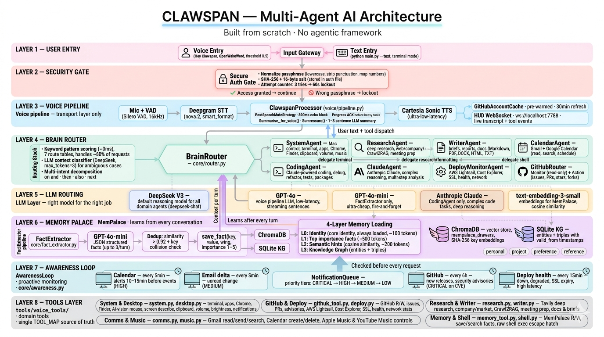
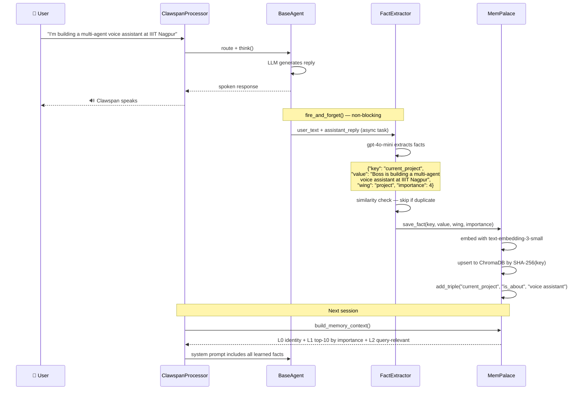
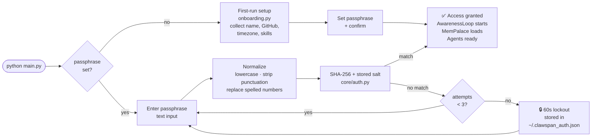
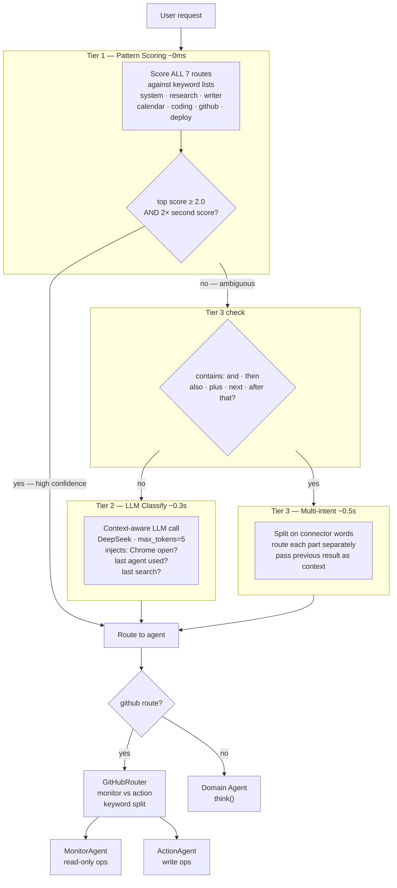
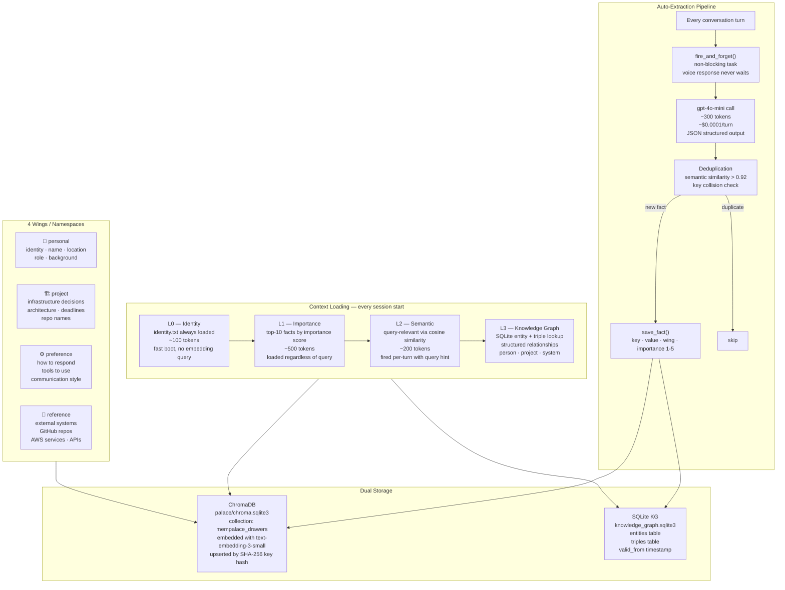
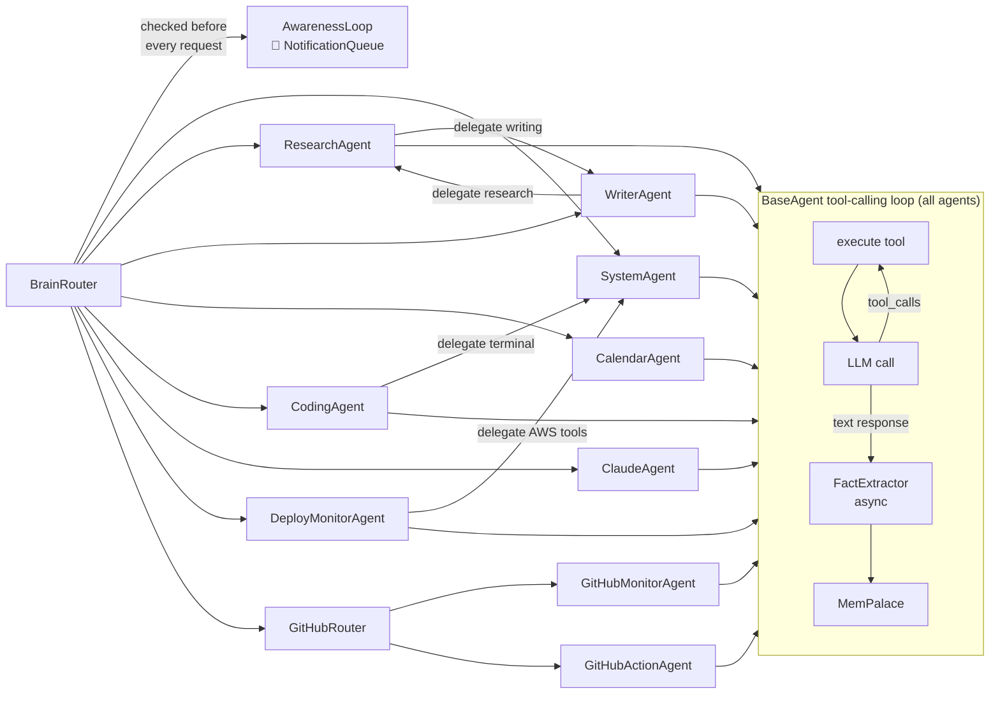

# Clawspan — Your Personal AI Chief of Staff, Running on Your Mac

> A voice-first, always-on AI servant that thinks like a co-founder.
> Built from scratch — no LangChain, no CrewAI, no agentic framework.
> Every part of the brain is hand-written Python. Pipecat handles voice I/O only.

> **⚠️ Platform Notice:** Clawspan is **macOS-only**. It relies on macOS-specific
> features such as AppleScript, `afplay`, `osascript`, `screencapture`, and
> PyAutoGUI for desktop automation. Linux and Windows support is not available
> at this time.

---

## What is Clawspan?

Clawspan is a voice-controlled AI assistant that lives on your Mac and acts like a co-founder who knows everything about you. You speak to it, it thinks, it acts — terminal commands, GitHub PRs, AWS health checks, deep research, structured docs, Gmail, Calendar. All through your voice.

Most voice assistants wait for a command and read back a raw API response. Clawspan is different:

- Heavy tools announce themselves before running ("Digging into it now, boss.")
- Results are compressed into 2-3 natural spoken sentences — no raw dumps reach TTS
- Created documents auto-open on screen the moment they're ready
- Tools run sequentially with live status, not in chaotic parallel
- It **learns facts about you** across sessions via a ChromaDB-backed Memory Palace that gets smarter every conversation
- A **passphrase gate** (SHA-256 + salt + lockout) protects access before any agent can run

This is not a wrapper around an existing AI platform. The intent routing, multi-agent orchestration, memory system, tool dispatch, and voice UX are all written from the ground up.

---

## Full Architecture



---

## Why No Agentic Framework?

Frameworks like LangChain, AutoGen, and CrewAI are powerful for demos. For a real-time voice assistant they introduce problems that are hard to paper over:

| | Framework | Clawspan |
|---|---|---|
| **Latency** | 100–300 ms of abstraction overhead per hop | Direct async Python — zero middleware |
| **Tool shape** | Framework normalises arguments, you lose control | Raw OpenAI function schemas, you define everything |
| **Memory** | Fragile vector-store integrations, hard to tune | Hand-rolled MemPalace — ChromaDB + SQLite KG |
| **Voice UX** | No concept of heavy vs light tools | `_HEAVY_TOOLS` frozenset, progress ACKs, LLM summariser gate |
| **Routing** | LLM call for every message | Tier 1 keyword scoring — ~0 ms, no LLM needed for 80% of requests |
| **Debugging** | Stack traces through 3 libraries you don't control | Your code all the way down |
| **Memory learning** | Generic — doesn't know who the user is | `FactExtractor` extracts personal facts after **every turn**, gets smarter over time |

> Pipecat is used for one specific reason: streaming mic → STT → TTS → speaker with VAD + turn detection. That's it. Everything above the transport layer is hand-written.

---

## How Clawspan Learns From You

Every conversation makes Clawspan smarter about you. Here's the exact flow:



Facts are tagged into four wings: `personal` (who you are), `project` (what you're building), `preference` (how you want Clawspan to behave), `reference` (external systems you use). They persist across restarts, update in place, and are deduplicated by semantic similarity.

---

## Security Gate

Before any agent runs, Clawspan requires authentication.



Password is stored as SHA-256 + random 16-byte salt in `~/.clawspan_auth.json`. Plaintext is never stored or logged. The normalizer handles voice STT quirks — spelled-out numbers ("iron man mark fifty"), punctuation, extra whitespace — so the same passphrase works whether typed or spoken.

---

## BrainRouter — 3-Tier Routing



Tier 1 handles ~80% of requests at near-zero cost. Tier 2 fires only when the top two keyword scores are within 20% of each other. Tier 3 fires when connector words suggest the user wants two different things done in sequence.

---

## Memory Palace — 4-Layer Architecture



---

## Agent Connections & Delegation



Agents can delegate sub-tasks to each other through the router (max depth 3 to prevent loops). The ResearchAgent can hand off a finished research brief to the WriterAgent to format it as a document. The CodingAgent can hand off shell commands to the SystemAgent.

---

## Why It's Fast

| Bottleneck | Typical framework | Clawspan |
|---|---|---|
| Intent routing | LLM call every time ~300-500ms | Keyword score ~0ms for 80% of requests |
| Tool dispatch | Serialised through framework abstractions | Direct Python function call |
| Memory read | Re-embedding query on every turn | L0 identity cached in file, L1 pre-sorted by importance |
| Memory write | Blocking call in response path | `fire_and_forget()` — non-blocking asyncio task |
| Voice response | Waits for full tool result | Streams sentences to TTS as they arrive via `_SENTENCE_END` regex |
| Tool result to voice | Raw output piped to TTS | `_summarise_for_voice()` compresses to 1-3 sentences before TTS |
| GitHub warmup | Cold lookup per request | `GitHubAccountCache` pre-warms pinned repos at boot |

---

## Capabilities

### Mac Control

| What you say | What happens |
|---|---|
| "Open VS Code" | `open_app` launches it instantly |
| "Run git status in terminal" | `run_terminal` executes, reports back in 1 sentence |
| "Take a screenshot" | `system_control` saves to Desktop |
| "Click the blue button on screen" | `mouse_control` → GPT-4o vision finds and clicks it |
| "What's on my screen right now" | `describe_screen` → GPT-4o vision describes everything visible |
| "Copy the last thing you said" | `clipboard` writes to macOS clipboard |
| "Find my CV in Documents" | `finder_control` Spotlight search by name |
| "Set volume to 40" | `system_control` adjusts system volume |

### GitHub (Full Read / Write)

| What you say | What happens |
|---|---|
| "Show my repos" | Lists your GitHub repos with descriptions |
| "What should I work on in jarvis" | `repo_insights` — risk scan, open issues, stale PRs |
| "Create an issue in clawspan about the auth bug" | Creates issue with title and body |
| "Track langchain-ai/langchain" | Adds to tracked repos, monitors releases |
| "Any updates from tracked repos" | Checks all tracked for new releases |
| "Search code for BaseAgent" | GitHub code search across all repos |
| "Check security advisories on jarvis" | Pulls advisory list |

### AWS & Deployments

| What you say | What happens |
|---|---|
| "What's my AWS status" | Lightsail instances, IPs, running state |
| "How's my server doing" | Health check on the named service |
| "How much am I spending on AWS" | Cost breakdown from Cost Explorer |
| "Is my site up" | HTTP health check + latency |
| "Check SSL for mycoolsite.com" | Certificate expiry + issuer |

### Research & Documents

| What you say | What happens |
|---|---|
| "Research Raga AI and save a doc" | Confirms → deep research → structured company brief → auto-opens on screen |
| "Market analysis for Tesla" | Market data, analyst sentiment, competitors → saves doc |
| "What is RAG, explain it properly" | `deep_research` → 2-3 spoken sentences + structured doc if asked |
| "Crawl docs.pipecat.ai into memory" | `crawl_to_rag` indexes the whole site into ChromaDB |

### Memory Palace

| What you say | What happens |
|---|---|
| "Remember I prefer TypeScript over JavaScript" | `memory_tool` saves tagged preference fact |
| "What do you know about my stack" | Semantic search across all saved facts |
| "I'm working on a multi-agent voice assistant" | Auto-extracted as a project fact — no explicit command |

---

## Voice UX Design

### Sequential tool dispatch
Tools run one at a time. If you ask Clawspan to "research Raga AI and write a doc":

1. **Confirms:** "Want me to research Raga AI and save a doc, boss?"
2. **Announces:** "Drafting the doc now." — spoken immediately while the heavy tool runs in background
3. **Summarises:** LLM compresses result into 2-3 natural sentences
4. **Opens:** "Your doc is saved as Raga AI Company Research.md and I've opened it for you, boss." — file opens on screen

### Heavy vs light tools
```python
_HEAVY_TOOLS = frozenset({
    "deep_research", "research_company", "market_research",
    "meeting_prep", "agentic_research", "crawl_to_rag",
    "writer_create", "writer_export", "repo_insights",
})
```
Heavy tools get a spoken progress ACK before they run and a full LLM summarisation after. Light tools (web search, terminal, clipboard) get a single-sentence confirmation.

### Echo suppression
`PostSpeechMuteStrategy` keeps the mic muted for 800 ms after Clawspan stops speaking, preventing Clawspan from hearing its own TTS output and responding to itself.

---

## Project Structure

```
clawspan/
│
├── main.py                     Entry — --text for terminal, default for voice
├── clawspan_pipeline.py          Thin shim → voice/pipeline.py
├── clawspan_tools.py             Thin shim → tools/voice_tools/
├── config.py                   API keys from .env
├── wake_word.py                "Hey Clawspan" (OpenWakeWord + ONNX)
│
├── voice/                      Voice pipeline (Pipecat transport only)
│   ├── pipeline.py             ClawspanProcessor + run_pipeline()
│   ├── system_prompt.py        SYSTEM_PROMPT + dynamic prompt builder per turn
│   ├── auth_gate.py            Passphrase gate
│   ├── mute_strategies.py      PostSpeechMuteStrategy
│   └── hud_server.py           WebSocket HUD (ws://localhost:7788)
│
├── core/                       Brain — all hand-rolled
│   ├── router.py               BrainRouter — 3-tier intent routing
│   ├── base_agent.py           BaseAgent — tool loop, DSML recovery, auto facts
│   ├── github_router.py        GitHub sub-router (monitor vs action)
│   ├── llm.py                  DeepSeek / OpenAI client factory
│   ├── profile.py              UserProfile (persistent JSON)
│   ├── context.py              SessionContext (in-memory turn state)
│   ├── fact_extractor.py       Async fact extraction from conversation turns
│   ├── awareness.py            AwarenessLoop — calendar / email / battery / GitHub / deploys
│   ├── auth.py                 SHA-256 + salt passphrase + lockout
│   ├── onboarding.py           First-run profile setup
│   ├── response.py             Response filter (strips raw tool dumps from voice)
│   └── prompts.py              Shared personality + response rules
│
├── agents/                     Domain agents (all extend BaseAgent)
│   ├── system_agent.py
│   ├── research_agent.py
│   ├── writer_agent.py
│   ├── calendar_agent.py
│   ├── coding_agent.py
│   ├── claude_agent.py
│   ├── deploy_monitor_agent.py
│   ├── github_monitor_agent.py
│   └── github_action_agent.py
│
├── tools/voice_tools/          Capability wrappers — one file per domain
│   ├── __init__.py             TOOLS list + TOOL_MAP + execute() — single source
│   ├── system.py               terminal, apps, Chrome, clipboard, volume
│   ├── desktop.py              Finder, AI-vision mouse, screen describe
│   ├── github_tool.py          Full GitHub R/W
│   ├── deploy.py               AWS + deploy tracker
│   ├── research.py             deep / company / market / crawl2RAG
│   ├── writer.py               docs (self-fetches research internally)
│   ├── comms.py                Gmail + Google Calendar
│   ├── music.py                Apple Music + YouTube Music
│   ├── memory_tool.py          MemPalace R/W from voice
│   └── shell.py                raw shell escape hatch
│
├── shared/
│   └── mempalace_adapter.py    ChromaDB + KG — full MemPalace API
│
└── tests/
    ├── test_auth.py
    ├── test_github_api.py
    ├── test_github_monitor.py
    ├── test_github_action.py
    ├── test_github_router.py
    ├── test_deploy_monitor.py
    └── test_onboarding.py
```

---

## Stack

| Component | Library | Role |
|---|---|---|
| Voice transport | Pipecat | Mic/speaker streaming, VAD, turn management — **voice I/O only** |
| Speech-to-text | Deepgram nova-2 | High-accuracy STT with smart formatting |
| Text-to-speech | Cartesia Sonic | Ultra-low-latency neural TTS |
| Wake word | OpenWakeWord (ONNX) | Local "Hey Clawspan" detection |
| LLM — voice pipeline | OpenAI gpt-4o | Low-latency voice turns |
| LLM — all agents | DeepSeek V3 | Fast, cheap domain agent reasoning |
| LLM — fact extraction | OpenAI gpt-4o-mini | ~$0.0001/turn background extraction |
| LLM — coding | Anthropic Claude | CodingAgent complex code tasks |
| Embeddings | OpenAI text-embedding-3-small | MemPalace semantic search |
| Vector store | ChromaDB | Persistent local semantic memory |
| Knowledge graph | SQLite | Entity + triple store |
| Research | Tavily | Live multi-source web research |
| Screen vision | GPT-4o vision | Describe screen, find click targets |
| Mac automation | PyAutoGUI + AppleScript | Mouse, keyboard, app control |
| AWS | boto3 | Lightsail, CloudWatch, Cost Explorer |

---

## Getting Started

### Prerequisites

- macOS (tested on macOS 15 Sequoia)
- Python 3.11+ — `brew install python@3.11`
- Node.js 18+ — `brew install node` (for HUD only)

### One-command setup

```bash
git clone https://github.com/akkupratap323/clawspan
cd clawspan
bash setup.sh
```

`setup.sh` will:
1. Check Python + Node are installed
2. Create and populate a Python virtual environment
3. Install HUD (Electron) dependencies
4. Walk you through entering all your API keys interactively
5. Create `~/Clawspan_Docs/` and `~/.mempalace/` directories
6. Install the `clawspan` CLI to `/usr/local/bin`

After setup completes you control everything through one command:

```
clawspan start      — voice mode (mic + wake word "Hey Clawspan")
clawspan text       — text mode  (terminal chat, no mic needed)
clawspan hud        — launch the Iron Man HUD overlay
clawspan stop       — stop all running processes
clawspan status     — show which processes are running
clawspan logs       — tail live log output
clawspan keys       — edit your .env API keys in $EDITOR
clawspan update     — pull latest code + refresh dependencies
clawspan setup      — re-run the full setup wizard
```

### API Keys

`setup.sh` will prompt for each one interactively. Here's where to get them:

#### Required

| Key | Where to get it |
|---|---|
| `DEEPSEEK_API_KEY` | [platform.deepseek.com](https://platform.deepseek.com) → API Keys — primary brain for all agents |
| `OPENAI_API_KEY` | [platform.openai.com](https://platform.openai.com/api-keys) — MemPalace embeddings |
| `DEEPGRAM_API_KEY` | [console.deepgram.com](https://console.deepgram.com) → Create API Key — speech-to-text |
| `CARTESIA_API_KEY` | [play.cartesia.ai](https://play.cartesia.ai) → API Keys — text-to-speech |

#### Optional (enables extra capabilities)

| Key | Where | What it unlocks |
|---|---|---|
| `ANTHROPIC_API_KEY` | [console.anthropic.com](https://console.anthropic.com/settings/keys) | Claude agent for complex code tasks |
| `TAVILY_API_KEY` | [app.tavily.com](https://app.tavily.com) | Deep web research, company briefs |
| `GITHUB_TOKEN` | [github.com/settings/tokens](https://github.com/settings/tokens) — scopes: `repo, read:user, read:org` | GitHub monitoring + issue/PR creation |
| `GOOGLE_CLIENT_ID` + `GOOGLE_CLIENT_SECRET` | [console.cloud.google.com](https://console.cloud.google.com) → Credentials → OAuth 2.0 Client IDs | Gmail + Google Calendar |
| `AWS_ACCESS_KEY_ID` + `AWS_SECRET_ACCESS_KEY` | AWS Console → IAM → Users → Security credentials | Lightsail health, cost monitoring |
| `CARTESIA_VOICE_ID` | [play.cartesia.ai](https://play.cartesia.ai) → Voice Library | Override the default British voice |

> You can also run `clawspan keys` at any time to open `.env` in your editor and add/update keys.

### First run

On first launch Clawspan will:
1. Ask you to set a passphrase (SHA-256 + salt, stored locally in `~/.clawspan_auth.json`)
2. Run a short onboarding: your name, GitHub username, timezone, and tech stack
3. Start learning from your conversations automatically via FactExtractor

---

## Adding a New Tool Domain

1. Create `tools/voice_tools/your_domain.py` with `exec_*` functions
2. Add OpenAI function schemas to `TOOLS` in `tools/voice_tools/__init__.py`
3. Add handlers to `TOOL_MAP` in the same file
4. Add guidance to `SYSTEM_PROMPT` in `voice/system_prompt.py`
5. If the tool is slow (>2 s), add it to `_HEAVY_TOOLS` in `voice/pipeline.py` and give it a progress line in `_HEAVY_PROGRESS_ACK`

---

## Status

Active development. Voice pipeline, BrainRouter, MemPalace, and all tool integrations are working. Open-sourcing in progress.

Built by [@akkupratap323](https://github.com/akkupratap323).

---

## License

MIT
